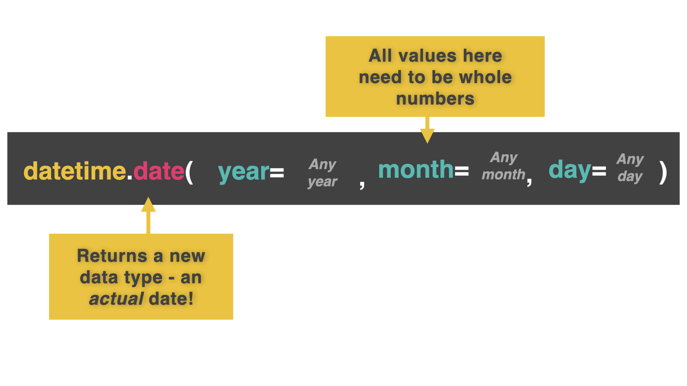

# The Magic of Time....

On day 60, we're going to learn about *time* (not time travel). Sorry to disappoint.

This can be quite a complicated thing, because we humans don't have nice standardized time.  Instead we have:
- 24 hour clocks
- AM and PM
- Months of differing lengths
- Leap years
- Leap seconds

And all sorts of oddities in our temporal framework.  

## Unix Epoch

👉 Your computer (and all of the other ones) uses something called the **Unix epoch** to measure time.

It counts the amount of seconds elapsed since Jan 1st, 1970 (even when the power's off - there's a small battery on your motherboard that keeps this function running).  

Then, it turns this into a meaningful format for you, you illogical human.

## datetime

To use the Unix epoch, we first need to import the **datetime** library


```python
import datetime
```

👉 Now I'm going to insert the date and assign it to a variable.

```python
import datetime

myDate = datetime.date(year=2022, month=12, day= 7)

print(myDate)

# This code outputs '2022-12-07'
```



You **HAVE** to use the year -> month -> day format for your arguments.  So Brits & Americans, put down your calendars and go find something else to argue about...

The reason for this format is that the elements get smaller (and less important) sequentially from left to right.  This makes sorting much easier.  

## Asking For A Date


👉 Let's use `datetime` to automatically get today's date.

```python
import datetime

today = datetime.date.today()

print(today)

# This code outputs the current date from your computer's clock.
```
Hmmm, remember when we were creating to-do lists and we had to *manually input* the date......

## Getting Date Input

👉 The easiest way to do this is to ask the user for day, month, and year in separate values.

```python
import datetime

day = int(input("Day: ")) # Get all input as numbers. We're not at text input for months yet.
month = int(input("Month: "))
year = int(input("Year: "))

date = datetime.date(year, month, day)

print(date)
```
### Try it out!