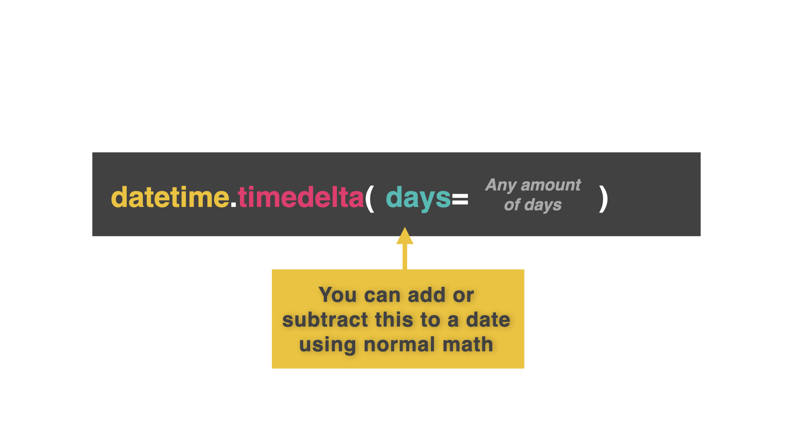

# Delta Force

A common task in programs is to work out the difference between two dates, for example to calculate someone's age.

To do this, we use a **time delta**.

Delta is a computer science term that means *the difference between two things*.

A *time delta* is a difference in time. The time delta between when you were born and now is increasing all the time as you age.

👉 Here's some code that calculates a time delta between today and two weeks today to see what the date will be in two weeks.


```python
import datetime

today = datetime.date.today() # Today's date

difference = datetime.timedelta(days=14) # The difference I want

newDate = today + difference # Add today to the delta difference to see the date in 14 days time.

print(newDate)
```

## If Statements With Dates

Provided you've formatted the date correctly, you can use the `>` `==` and `<` comparison operators just like you can with integers.

👉 I can use this to tell me if I should be on vacation or not!

```python
import datetime

today = datetime.date.today() # Today's date

holiday = datetime.date(year = 2022, month = 10, day = 30) # The date of my holiday

if holiday > today: # If my holiday is in the future
  print("Coming soon")
elif holiday < today: #If my holiday date has passed
  print("Hope you enjoyed it")
else: # If my holiday date is today
  print("HOLIDAY TIME!")
```

### Try it out!